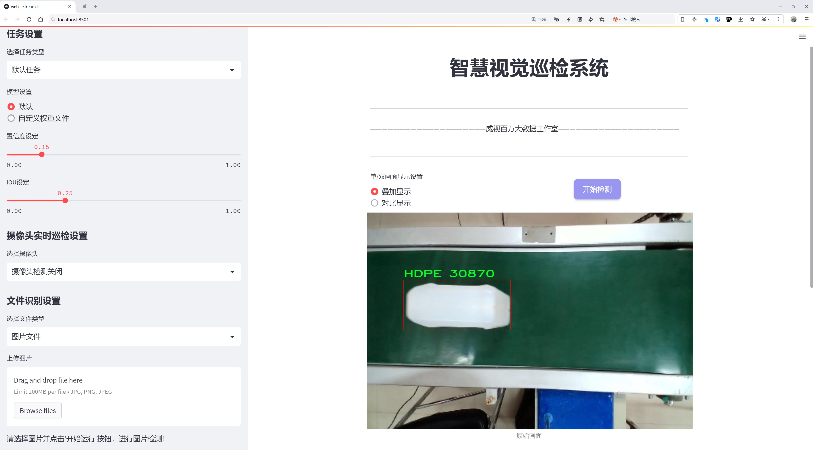
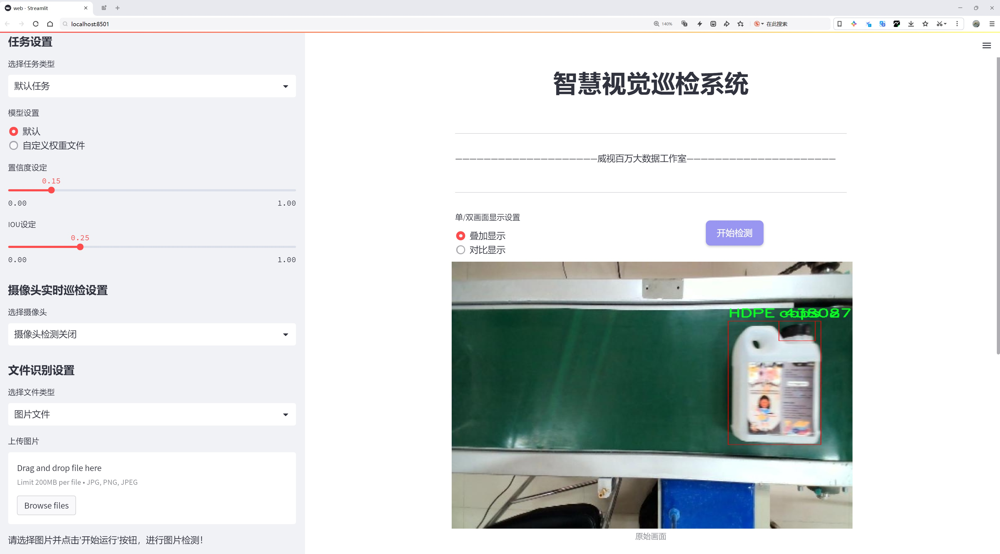
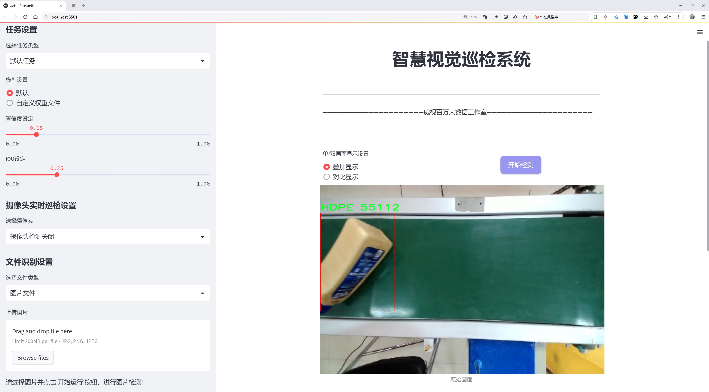
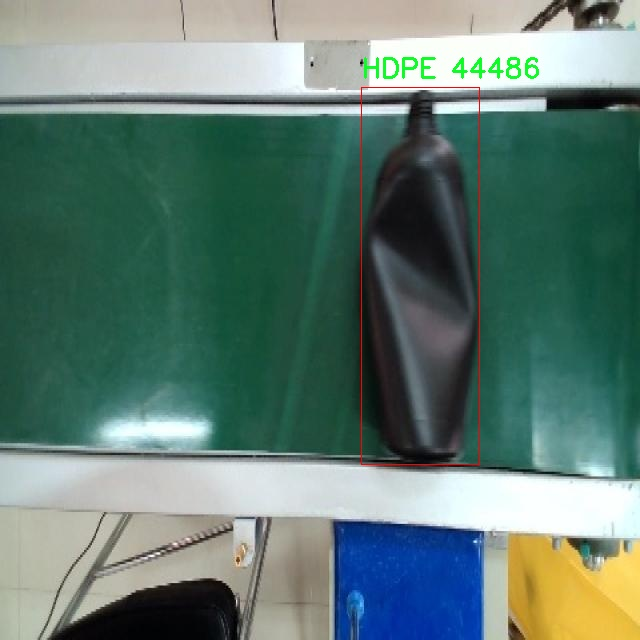
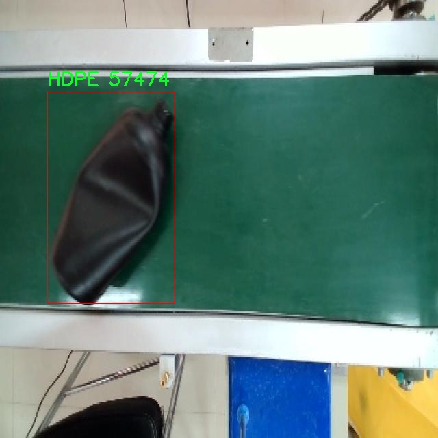
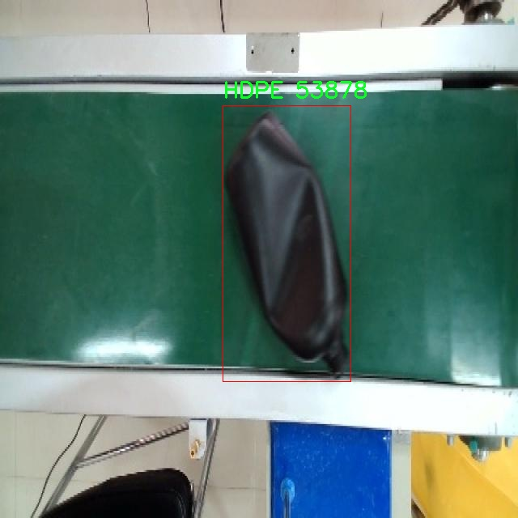
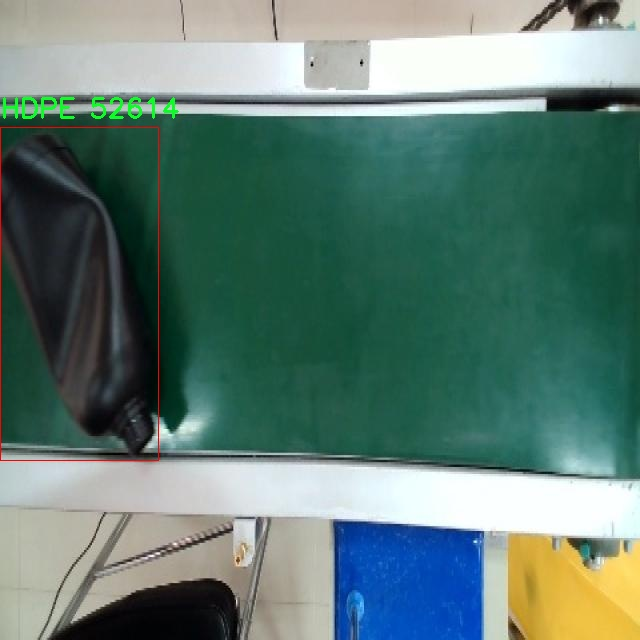
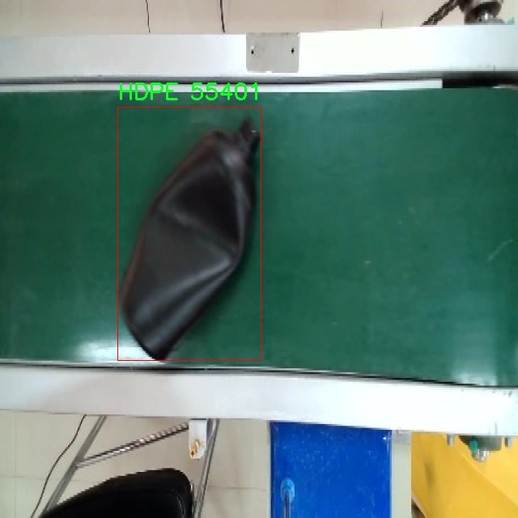

# 塑料瓶回收流水线分拣检测系统源码分享
 # [一条龙教学YOLOV8标注好的数据集一键训练_70+全套改进创新点发刊_Web前端展示]

### 1.研究背景与意义

项目参考[AAAI Association for the Advancement of Artificial Intelligence](https://gitee.com/qunmasj/projects)

项目来源[AACV Association for the Advancement of Computer Vision](https://kdocs.cn/l/cszuIiCKVNis)

研究背景与意义

随着全球塑料污染问题的日益严重，塑料瓶的回收与再利用成为了环境保护和资源节约的重要议题。塑料瓶，尤其是高密度聚乙烯（HDPE）和聚对苯二甲酸乙二醇酯（PET），在日常生活中广泛使用，其回收利用不仅能够减少环境负担，还能为资源的循环利用提供可行方案。然而，传统的塑料瓶回收方式往往依赖人工分拣，效率低下且容易出现错误，导致回收率不高。因此，构建一个高效、准确的自动化分拣系统显得尤为重要。

近年来，计算机视觉技术的迅猛发展为塑料瓶的自动化分拣提供了新的解决方案。YOLO（You Only Look Once）系列目标检测算法因其高效性和实时性，在物体识别和分类任务中得到了广泛应用。YOLOv8作为该系列的最新版本，具备更强的特征提取能力和更快的处理速度，适合用于复杂的分拣场景。通过对YOLOv8的改进，可以进一步提升其在塑料瓶回收流水线分拣系统中的应用效果，进而提高分拣的准确性和效率。

本研究的目标是基于改进的YOLOv8算法，设计并实现一个塑料瓶回收流水线分拣系统。该系统将利用5500张图像的数据集进行训练，数据集中包含三类物体：HDPE瓶、PET瓶及瓶盖。这些数据不仅涵盖了不同种类的塑料瓶，还包括了多种拍摄角度和光照条件下的图像，能够有效提升模型的泛化能力和鲁棒性。通过对这些数据的深入分析与处理，研究将探索如何优化YOLOv8的参数设置，以实现更高的检测精度和更快的处理速度。

本研究的意义在于，首先，推动了塑料瓶回收技术的进步，促进了环境保护和资源的可持续利用。其次，通过引入先进的深度学习算法，提升了传统分拣系统的智能化水平，减少了人工干预，提高了工作效率。此外，本研究还将为相关领域的研究提供有价值的参考，推动智能制造和绿色经济的发展。

综上所述，基于改进YOLOv8的塑料瓶回收流水线分拣系统的研究，不仅具有重要的理论价值，也具备广泛的应用前景。通过有效的技术手段应对塑料污染问题，将为实现可持续发展目标贡献一份力量。

### 2.图片演示







##### 注意：由于此博客编辑较早，上面“2.图片演示”和“3.视频演示”展示的系统图片或者视频可能为老版本，新版本在老版本的基础上升级如下：（实际效果以升级的新版本为准）

  （1）适配了YOLOV8的“目标检测”模型和“实例分割”模型，通过加载相应的权重（.pt）文件即可自适应加载模型。

  （2）支持“图片识别”、“视频识别”、“摄像头实时识别”三种识别模式。

  （3）支持“图片识别”、“视频识别”、“摄像头实时识别”三种识别结果保存导出，解决手动导出（容易卡顿出现爆内存）存在的问题，识别完自动保存结果并导出到tempDir中。

  （4）支持Web前端系统中的标题、背景图等自定义修改，后面提供修改教程。

  另外本项目提供训练的数据集和训练教程,暂不提供权重文件（best.pt）,需要您按照教程进行训练后实现图片演示和Web前端界面演示的效果。

### 3.视频演示

[3.1 视频演示](https://www.bilibili.com/video/BV1rvsQeME2P/)

### 4.数据集信息展示

##### 4.1 本项目数据集详细数据（类别数＆类别名）

nc: 3
names: ['HDPE', 'PET', 'caps']


##### 4.2 本项目数据集信息介绍

数据集信息展示

在现代环保与资源回收的背景下，塑料瓶的回收处理成为了一个亟待解决的重要问题。为此，我们构建了一个专门用于训练改进YOLOv8模型的“plastic bottle”数据集，以提高塑料瓶回收流水线的分拣效率和准确性。该数据集包含了三种主要类别，分别是高密度聚乙烯（HDPE）、聚对苯二甲酸乙二醇酯（PET）以及瓶盖（caps）。这些类别的选择不仅反映了市场上常见的塑料瓶种类，也对应了实际回收过程中需要重点识别的物品。

在数据集的构建过程中，我们收集了大量的图像数据，确保每一类的样本数量充足且多样化。HDPE塑料瓶通常用于牛奶、洗涤剂等液体的包装，其特征包括较厚的瓶壁和通常为白色或半透明的外观。PET塑料瓶则广泛应用于饮料包装，通常呈现出透明或绿色的色调，瓶身较为轻便。瓶盖作为塑料瓶的重要组成部分，虽然体积较小，但在回收过程中同样需要被准确识别，以确保回收流程的完整性和高效性。

为了提高模型的泛化能力，我们在数据集中引入了多种拍摄角度、光照条件和背景环境的变化。这样一来，模型在训练过程中能够学习到不同环境下的物体特征，从而在实际应用中表现出更强的适应性。此外，我们还进行了数据增强处理，包括旋转、缩放、裁剪等操作，以进一步丰富数据集的多样性。这些措施不仅提升了模型的准确性，也为后续的实际应用奠定了坚实的基础。

数据集的标注工作是确保模型训练质量的关键环节。我们采用了专业的标注工具，对每一张图像中的目标进行了精确的框选和分类。通过严格的标注标准，确保了每个类别的样本在数据集中的准确性和一致性。标注完成后，我们对数据集进行了多轮审核，确保数据的质量和完整性，最终形成了一个高质量的训练集。

在实际应用中，改进YOLOv8模型将利用该数据集进行训练，以实现对塑料瓶的快速识别和分类。通过深度学习技术，模型将能够实时处理流水线上的图像数据，自动识别出不同类型的塑料瓶及其瓶盖，从而实现高效的分拣作业。这不仅能够提高回收效率，减少人工成本，还能在一定程度上降低因分拣错误而导致的资源浪费。

综上所述，“plastic bottle”数据集为塑料瓶回收流水线分拣系统的训练提供了坚实的基础。通过对HDPE、PET和瓶盖三类物品的深入研究与分析，该数据集不仅具备丰富的样本和多样的特征，还为后续的模型优化和实际应用提供了重要的数据支持。随着回收技术的不断进步和环保意识的提升，期待该数据集能够为塑料瓶的高效回收做出积极贡献。











### 5.全套项目环境部署视频教程（零基础手把手教学）

[5.1 环境部署教程链接（零基础手把手教学）](https://www.ixigua.com/7404473917358506534?logTag=c807d0cbc21c0ef59de5)


[5.2 安装Python虚拟环境创建和依赖库安装视频教程链接（零基础手把手教学）](https://www.ixigua.com/7404474678003106304?logTag=1f1041108cd1f708b01a)

### 6.手把手YOLOV8训练视频教程（零基础小白有手就能学会）

[6.1 手把手YOLOV8训练视频教程（零基础小白有手就能学会）](https://www.ixigua.com/7404477157818401292?logTag=d31a2dfd1983c9668658)

### 7.70+种全套YOLOV8创新点代码加载调参视频教程（一键加载写好的改进模型的配置文件）

[7.1 70+种全套YOLOV8创新点代码加载调参视频教程（一键加载写好的改进模型的配置文件）](https://www.ixigua.com/7404478314661806627?logTag=29066f8288e3f4eea3a4)

### 8.70+种全套YOLOV8创新点原理讲解（非科班也可以轻松写刊发刊，V10版本正在科研待更新）

由于篇幅限制，每个创新点的具体原理讲解就不一一展开，具体见下列网址中的创新点对应子项目的技术原理博客网址【Blog】：


[8.1 70+种全套YOLOV8创新点原理讲解链接](https://gitee.com/qunmasj/good)

### 9.系统功能展示（检测对象为举例，实际内容以本项目数据集为准）

图9.1.系统支持检测结果表格显示

  图9.2.系统支持置信度和IOU阈值手动调节

  图9.3.系统支持自定义加载权重文件best.pt(需要你通过步骤5中训练获得)

  图9.4.系统支持摄像头实时识别

  图9.5.系统支持图片识别

  图9.6.系统支持视频识别

  图9.7.系统支持识别结果文件自动保存

  图9.8.系统支持Excel导出检测结果数据


### 10.原始YOLOV8算法原理

原始YOLOv8算法原理

YOLOv8是由Ultralytics团队在2023年1月推出的目标检测模型，它在YOLOv5的基础上进行了多项重要改进，旨在提升目标检测的精度和速度。YOLOv8不仅延续了YOLO系列的核心思想，即将整个图像作为输入进行实时目标检测，还引入了多种新技术，以适应日益复杂的应用场景和需求。

在YOLOv8的架构中，输入层负责将图像缩放到预定的尺寸，以便后续的特征提取和处理。主干网络是YOLOv8的核心部分，主要通过卷积操作对输入图像进行下采样，从而提取出多层次的特征。与YOLOv5相比，YOLOv8在主干网络中采用了C2f模块，取代了之前的C3模块。C2f模块的设计灵感来源于YOLOv7中的ELAN结构，增加了更多的跳层连接，增强了梯度流的丰富性。这种设计不仅提高了特征提取的能力，还有效地减少了模型的计算量，使得YOLOv8在保持高精度的同时，具备了更好的轻量化特性。

在主干网络的末尾，YOLOv8引入了SPPF（Spatial Pyramid Pooling Fast）模块，该模块通过三个最大池化层来处理多尺度特征，进一步增强了网络的特征抽象能力。这一设计使得YOLOv8能够更好地应对不同尺寸和形状的目标，提高了检测的鲁棒性。

颈部网络则负责将主干网络提取的特征进行融合和传递。YOLOv8采用了FPNS（Feature Pyramid Network）和PAN（Path Aggregation Network）结构，以有效整合来自不同尺度的特征图。这种特征融合策略使得YOLOv8能够在处理复杂场景时，充分利用各层次的特征信息，从而提升检测的准确性。

在头部网络中，YOLOv8引入了解耦检测头的设计思路。该结构将类别和位置的特征提取分为两个并行的分支，分别负责回归和分类任务。这种分离的处理方式使得模型在进行目标定位时，能够更专注于边界框与真实框之间的关系，而在分类任务中，则能够更好地分析特征图中的类别相似性。这种结构的引入，不仅提高了模型的收敛速度，还在预测精度上取得了显著提升。

YOLOv8还采用了无锚框结构，直接预测目标的中心位置。这一创新使得模型在处理目标检测时，减少了对先验框的依赖，进而提高了检测的灵活性和适应性。此外，YOLOv8引入了任务对齐学习（Task Alignment Learning, TAL），通过引入分类分数和IOU的高次幂乘积作为衡量任务对齐程度的指标，进一步优化了分类和定位的损失函数。这一策略使得模型在训练过程中，能够更好地平衡分类和定位的性能，确保在不同任务中都能取得理想的效果。

在实际应用中，YOLOv8的检测性能得到了广泛的验证。根据官方在COCO数据集上的测试结果，YOLOv8在同尺寸模型中实现了更高的mAP（mean Average Precision），并且在推理速度上也表现出色。这一系列的改进使得YOLOv8在实时性和准确性之间找到了良好的平衡，特别适合于需要快速响应的应用场景，如智能监控、自动驾驶和人脸识别等。

综上所述，YOLOv8作为YOLO系列的最新版本，通过对网络结构的优化和新技术的引入，显著提升了目标检测的性能。其在特征提取、特征融合、任务处理等多个方面的创新，使得YOLOv8不仅在精度上超越了前代模型，还在推理速度上实现了显著提升。这些优势使得YOLOv8在各种实际应用中具备了广泛的适用性和良好的研究价值，成为目标检测领域的重要工具。


### 11.项目核心源码讲解（再也不用担心看不懂代码逻辑）

#### 11.1 code\ultralytics\models\yolo\segment\train.py

以下是经过简化和注释的核心代码部分，保留了最重要的功能和结构：

```python
# 引入必要的库和模块
from copy import copy
from ultralytics.models import yolo
from ultralytics.nn.tasks import SegmentationModel
from ultralytics.utils import DEFAULT_CFG, RANK
from ultralytics.utils.plotting import plot_images, plot_results

class SegmentationTrainer(yolo.detect.DetectionTrainer):
    """
    扩展DetectionTrainer类以支持基于分割模型的训练。
    示例用法：
        ```python
        from ultralytics.models.yolo.segment import SegmentationTrainer

        args = dict(model='yolov8n-seg.pt', data='coco8-seg.yaml', epochs=3)
        trainer = SegmentationTrainer(overrides=args)
        trainer.train()
        ```
    """

    def __init__(self, cfg=DEFAULT_CFG, overrides=None, _callbacks=None):
        """初始化SegmentationTrainer对象，设置配置和参数。"""
        if overrides is None:
            overrides = {}
        overrides["task"] = "segment"  # 设置任务类型为分割
        super().__init__(cfg, overrides, _callbacks)  # 调用父类构造函数

    def get_model(self, cfg=None, weights=None, verbose=True):
        """返回初始化的SegmentationModel模型，使用指定的配置和权重。"""
        model = SegmentationModel(cfg, ch=3, nc=self.data["nc"], verbose=verbose and RANK == -1)
        if weights:
            model.load(weights)  # 加载指定的权重

        return model  # 返回模型实例

    def get_validator(self):
        """返回SegmentationValidator实例，用于YOLO模型的验证。"""
        self.loss_names = "box_loss", "seg_loss", "cls_loss", "dfl_loss"  # 定义损失名称
        return yolo.segment.SegmentationValidator(
            self.test_loader, save_dir=self.save_dir, args=copy(self.args), _callbacks=self.callbacks
        )  # 返回验证器实例

    def plot_training_samples(self, batch, ni):
        """创建训练样本图像的绘图，包含标签和边框坐标。"""
        plot_images(
            batch["img"],  # 输入图像
            batch["batch_idx"],  # 批次索引
            batch["cls"].squeeze(-1),  # 类别标签
            batch["bboxes"],  # 边框坐标
            masks=batch["masks"],  # 分割掩码
            paths=batch["im_file"],  # 图像文件路径
            fname=self.save_dir / f"train_batch{ni}.jpg",  # 保存图像的文件名
            on_plot=self.on_plot,  # 绘图回调
        )

    def plot_metrics(self):
        """绘制训练和验证的指标。"""
        plot_results(file=self.csv, segment=True, on_plot=self.on_plot)  # 保存结果图像
```

### 代码说明：
1. **导入模块**：引入必要的模块和函数以支持模型训练和结果绘图。
2. **SegmentationTrainer类**：继承自`DetectionTrainer`，用于分割模型的训练。
3. **构造函数**：初始化时设置任务类型为分割，并调用父类的构造函数。
4. **get_model方法**：根据配置和权重返回一个分割模型实例。
5. **get_validator方法**：返回一个用于验证的分割验证器实例，并定义损失名称。
6. **plot_training_samples方法**：用于绘制训练样本的图像，包括类别、边框和掩码信息。
7. **plot_metrics方法**：绘制训练和验证过程中的指标图。

通过这些核心部分，代码实现了YOLO模型的分割训练和验证功能。

这个文件是一个用于训练YOLO（You Only Look Once）模型进行图像分割的Python脚本，主要定义了一个名为`SegmentationTrainer`的类。该类继承自`DetectionTrainer`，并扩展了用于图像分割的功能。

在文件开头，导入了一些必要的模块和类，包括YOLO模型、分割模型、默认配置、排名以及用于绘图的工具。接下来，`SegmentationTrainer`类的文档字符串提供了一个简单的示例，展示了如何使用这个类进行训练。用户可以通过传入模型路径、数据集配置文件和训练轮数等参数来初始化训练器，并调用`train()`方法开始训练。

构造函数`__init__`用于初始化`SegmentationTrainer`对象。如果没有提供覆盖参数，则使用一个空字典。它将任务类型设置为“segment”，并调用父类的构造函数进行初始化。

`get_model`方法用于返回一个初始化好的分割模型。它接受配置和权重参数，如果提供了权重，则会加载这些权重。该方法创建了一个`SegmentationModel`实例，并设置通道数和类别数。

`get_validator`方法返回一个`SegmentationValidator`实例，用于验证YOLO模型的性能。在这个方法中，定义了损失名称，包括框损失、分割损失、分类损失和DFL损失。

`plot_training_samples`方法用于创建一个包含训练样本图像、标签和框坐标的绘图。它调用`plot_images`函数，将当前批次的图像及其相关信息绘制并保存为图像文件。

最后，`plot_metrics`方法用于绘制训练和验证过程中的指标。它调用`plot_results`函数，将结果保存为图像文件。

整体而言，这个文件提供了一个完整的框架，用于训练YOLO模型进行图像分割任务，包含了模型初始化、验证、绘图等多个方面的功能。

#### 11.2 70+种YOLOv8算法改进源码大全和调试加载训练教程（非必要）\ultralytics\models\yolo\segment\train.py

以下是经过简化和注释的代码，保留了核心部分并进行了详细的中文注释：

```python
# 导入必要的库和模块
from copy import copy
from ultralytics.models import yolo
from ultralytics.nn.tasks import SegmentationModel
from ultralytics.utils import DEFAULT_CFG, RANK
from ultralytics.utils.plotting import plot_images, plot_results

class SegmentationTrainer(yolo.detect.DetectionTrainer):
    """
    扩展自 DetectionTrainer 类，用于基于分割模型的训练。
    """

    def __init__(self, cfg=DEFAULT_CFG, overrides=None, _callbacks=None):
        """初始化 SegmentationTrainer 对象，设置配置和参数。"""
        if overrides is None:
            overrides = {}
        overrides['task'] = 'segment'  # 设置任务类型为分割
        super().__init__(cfg, overrides, _callbacks)  # 调用父类构造函数

    def get_model(self, cfg=None, weights=None, verbose=True):
        """返回初始化的 SegmentationModel，使用指定的配置和权重。"""
        # 创建分割模型实例
        model = SegmentationModel(cfg, ch=3, nc=self.data['nc'], verbose=verbose and RANK == -1)
        if weights:
            model.load(weights)  # 如果提供了权重，则加载权重

        return model  # 返回模型实例

    def get_validator(self):
        """返回用于验证 YOLO 模型的 SegmentationValidator 实例。"""
        self.loss_names = 'box_loss', 'seg_loss', 'cls_loss', 'dfl_loss'  # 定义损失名称
        # 创建并返回 SegmentationValidator 实例
        return yolo.segment.SegmentationValidator(self.test_loader, save_dir=self.save_dir, args=copy(self.args))

    def plot_training_samples(self, batch, ni):
        """创建训练样本图像的绘图，包括标签和框坐标。"""
        plot_images(batch['img'],  # 训练图像
                    batch['batch_idx'],  # 批次索引
                    batch['cls'].squeeze(-1),  # 类别标签
                    batch['bboxes'],  # 边界框
                    batch['masks'],  # 掩码
                    paths=batch['im_file'],  # 图像文件路径
                    fname=self.save_dir / f'train_batch{ni}.jpg',  # 保存文件名
                    on_plot=self.on_plot)  # 绘图回调

    def plot_metrics(self):
        """绘制训练和验证指标。"""
        plot_results(file=self.csv, segment=True, on_plot=self.on_plot)  # 保存结果图像
```

### 代码核心部分解释：
1. **类 SegmentationTrainer**：这是一个用于训练分割模型的类，继承自 YOLO 的检测训练器。
2. **初始化方法 `__init__`**：设置任务类型为分割，并调用父类的初始化方法。
3. **`get_model` 方法**：创建并返回一个分割模型实例，支持加载预训练权重。
4. **`get_validator` 方法**：返回一个验证器实例，用于模型验证，定义了损失名称。
5. **`plot_training_samples` 方法**：绘制训练样本的图像，包括标签和边界框信息。
6. **`plot_metrics` 方法**：绘制训练和验证过程中的指标图。

该程序文件是一个用于YOLOv8模型进行图像分割任务的训练脚本，属于Ultralytics YOLO项目的一部分。文件中定义了一个名为`SegmentationTrainer`的类，该类继承自`DetectionTrainer`，专门用于处理图像分割的训练过程。

在类的构造函数`__init__`中，首先初始化了一些参数。如果没有提供覆盖参数`overrides`，则会创建一个空字典。接着，将任务类型设置为“segment”，并调用父类的构造函数进行初始化。

`get_model`方法用于返回一个初始化的`SegmentationModel`实例。该方法接受配置文件`cfg`和权重文件`weights`作为参数。如果提供了权重文件，则会加载相应的权重。这个模型的通道数`ch`被设置为3（表示RGB图像），类别数`nc`则从数据集中获取。

`get_validator`方法返回一个`SegmentationValidator`实例，用于验证YOLO模型的性能。在此方法中，定义了损失名称，包括边界框损失、分割损失、分类损失和DFL损失，以便在训练过程中进行监控。

`plot_training_samples`方法用于创建训练样本图像的可视化，展示图像、标签和边界框坐标。它会生成一个包含当前批次训练样本的图像，并将其保存到指定的目录中。

最后，`plot_metrics`方法用于绘制训练和验证过程中的指标。它调用`plot_results`函数，将训练结果保存为`results.png`文件，便于后续分析。

总体来说，这个文件为YOLOv8的图像分割任务提供了一个完整的训练框架，包含模型初始化、验证、可视化等功能，便于用户进行深度学习模型的训练和调试。

#### 11.3 ui.py

以下是经过简化并注释的核心代码部分：

```python
import sys
import subprocess

def run_script(script_path):
    """
    使用当前 Python 环境运行指定的脚本。

    Args:
        script_path (str): 要运行的脚本路径

    Returns:
        None
    """
    # 获取当前 Python 解释器的路径
    python_path = sys.executable

    # 构建运行命令，使用 streamlit 运行指定的脚本
    command = f'"{python_path}" -m streamlit run "{script_path}"'

    # 执行命令，并等待其完成
    result = subprocess.run(command, shell=True)
    
    # 检查命令执行结果，如果返回码不为0，表示出错
    if result.returncode != 0:
        print("脚本运行出错。")

# 主程序入口
if __name__ == "__main__":
    # 指定要运行的脚本路径
    script_path = "web.py"  # 这里可以直接指定脚本名称

    # 调用函数运行脚本
    run_script(script_path)
```

### 代码注释说明：
1. **导入模块**：
   - `sys`：用于获取当前 Python 解释器的路径。
   - `subprocess`：用于执行外部命令。

2. **`run_script` 函数**：
   - 接收一个脚本路径作为参数。
   - 获取当前 Python 解释器的路径。
   - 构建一个命令字符串，用于运行 `streamlit` 应用。
   - 使用 `subprocess.run` 执行命令，并等待其完成。
   - 检查命令的返回码，如果不为0，表示脚本运行出错，打印错误信息。

3. **主程序入口**：
   - 当脚本作为主程序运行时，指定要运行的脚本路径（在这里是 `web.py`）。
   - 调用 `run_script` 函数来执行指定的脚本。

这个程序文件名为 `ui.py`，其主要功能是通过当前的 Python 环境运行一个指定的脚本。代码首先导入了必要的模块，包括 `sys`、`os` 和 `subprocess`，以及一个自定义的路径处理函数 `abs_path`，这个函数来自于 `QtFusion.path` 模块。

在 `run_script` 函数中，程序接受一个参数 `script_path`，这个参数是要运行的脚本的路径。函数内部首先获取当前 Python 解释器的路径，这通过 `sys.executable` 实现。接着，程序构建一个命令字符串，使用 `streamlit` 模块来运行指定的脚本。命令的格式是将 Python 解释器的路径与 `-m streamlit run` 和脚本路径结合在一起。

然后，程序使用 `subprocess.run` 方法来执行这个命令。`shell=True` 参数允许在 shell 中执行命令。如果命令执行后返回的状态码不为零，说明脚本运行出错，程序会打印出一条错误信息。

在文件的最后部分，程序通过 `if __name__ == "__main__":` 判断当前模块是否是主程序。如果是，它会指定要运行的脚本路径，这里使用了 `abs_path` 函数来获取 `web.py` 的绝对路径。最后，调用 `run_script` 函数来执行这个脚本。

整体来看，这个程序的主要目的是提供一个简单的接口，通过命令行运行一个 Streamlit 应用，方便用户在当前 Python 环境中启动指定的脚本。

#### 11.4 code\model.py

以下是代码中最核心的部分，并附上详细的中文注释：

```python
# -*- coding: utf-8 -*-
import cv2  # 导入OpenCV库，用于处理图像和视频
import torch  # 导入PyTorch库，用于深度学习
from QtFusion.models import Detector  # 从QtFusion库中导入Detector抽象基类
from chinese_name_list import Chinese_name  # 从datasets库中导入Chinese_name字典，用于获取类别的中文名称
from ultralytics import YOLO  # 从ultralytics库中导入YOLO类，用于加载YOLO模型
from ultralytics.utils.torch_utils import select_device  # 从ultralytics库中导入select_device函数，用于选择设备
import os  # 导入os库，用于处理文件和目录

# 根据是否有可用的GPU选择设备
device = "cuda:0" if torch.cuda.is_available() else "cpu"

# 初始化参数字典
ini_params = {
    'device': device,  # 设备类型
    'conf': 0.25,  # 物体置信度阈值
    'iou': 0.5,  # 用于非极大值抑制的IOU阈值
    'classes': None,  # 类别过滤器
    'verbose': False  # 是否输出详细信息
}

class Web_Detector(Detector):  # 定义Web_Detector类，继承自Detector类
    def __init__(self, params=None):  # 构造函数
        super().__init__(params)  # 调用父类构造函数
        self.model = None  # 初始化模型为None
        self.img = None  # 初始化图像为None
        self.names = list(Chinese_name.values())  # 获取所有类别的中文名称
        self.params = params if params else ini_params  # 使用提供的参数或默认参数

    def load_model(self, model_path):  # 加载模型的方法
        self.device = select_device(self.params['device'])  # 选择设备
        # 根据模型文件名判断任务类型
        task = 'segment' if os.path.basename(model_path)[:3] == 'seg' else 'detect'
        self.model = YOLO(model_path, task=task)  # 加载YOLO模型
        names_dict = self.model.names  # 获取类别名称字典
        # 将类别名称转换为中文
        self.names = [Chinese_name[v] if v in Chinese_name else v for v in names_dict.values()]
        # 预热模型
        self.model(torch.zeros(1, 3, *[self.imgsz] * 2).to(self.device).type_as(next(self.model.model.parameters())))

    def preprocess(self, img):  # 预处理方法
        self.img = img  # 保存原始图像
        return img  # 返回处理后的图像

    def predict(self, img):  # 预测方法
        results = self.model(img, **ini_params)  # 使用模型进行预测
        return results  # 返回预测结果

    def postprocess(self, pred):  # 后处理方法
        results = []  # 初始化结果列表
        for res in pred[0].boxes:  # 遍历预测结果中的每个边界框
            for box in res:  # 遍历每个边界框
                class_id = int(box.cls.cpu())  # 获取类别ID
                bbox = box.xyxy.cpu().squeeze().tolist()  # 获取边界框坐标
                bbox = [int(coord) for coord in bbox]  # 转换为整数

                # 构建结果字典
                result = {
                    "class_name": self.names[class_id],  # 类别名称
                    "bbox": bbox,  # 边界框
                    "score": box.conf.cpu().squeeze().item(),  # 置信度
                    "class_id": class_id,  # 类别ID
                    "mask": pred[0].masks[aim_id].xy if pred[0].masks is not None else None  # 边界框
                }
                results.append(result)  # 将结果添加到列表

        return results  # 返回结果列表

    def set_param(self, params):  # 设置参数的方法
        self.params.update(params)  # 更新参数
```

### 代码说明：
1. **设备选择**：根据系统是否有可用的GPU来选择计算设备。
2. **参数初始化**：定义了一些模型参数，如置信度阈值和IOU阈值。
3. **Web_Detector类**：这是一个继承自Detector的类，主要用于加载YOLO模型、进行图像预处理、预测和后处理。
4. **模型加载**：根据模型路径判断任务类型（检测或分割），并加载相应的YOLO模型。
5. **图像预处理**：保存原始图像并返回。
6. **预测**：使用加载的模型对图像进行预测。
7. **后处理**：处理预测结果，提取类别名称、边界框、置信度等信息，并将其存储在结果列表中。
8. **参数设置**：更新模型参数的方法。

这个程序文件 `model.py` 是一个用于图像检测的模型实现，主要依赖于YOLO（You Only Look Once）算法。程序首先导入了必要的库，包括OpenCV、PyTorch以及一些自定义的模块和数据集。接着，它定义了一些初始化参数，例如设备类型（CPU或GPU）、物体置信度阈值、IOU阈值等。

在程序中，定义了一个 `count_classes` 函数，用于统计检测结果中每个类别的数量。这个函数接收检测信息和类别名称列表，返回一个包含每个类别计数的列表。

接下来，定义了一个 `Web_Detector` 类，继承自 `Detector` 抽象基类。该类的构造函数初始化了一些属性，包括模型、图像和类别名称。它还定义了一个 `load_model` 方法，用于加载YOLO模型，并根据模型文件名判断任务类型（检测或分割）。在加载模型后，它会将类别名称转换为中文，并进行模型的预热。

类中还包含了三个主要的方法：`preprocess`、`predict` 和 `postprocess`。`preprocess` 方法用于处理输入图像，`predict` 方法调用YOLO模型进行预测，返回预测结果。`postprocess` 方法则对预测结果进行后处理，提取出每个检测框的类别名称、边界框坐标、置信度等信息，并将这些信息以字典的形式存储在结果列表中。

最后，类中还定义了一个 `set_param` 方法，用于更新检测器的参数。整体来看，这个程序文件实现了一个基于YOLO的图像检测器，能够加载模型、处理图像并返回检测结果。

#### 11.5 train.py

以下是代码中最核心的部分，并附上详细的中文注释：

```python
class DetectionTrainer(BaseTrainer):
    """
    DetectionTrainer类用于基于检测模型进行训练，继承自BaseTrainer类。
    """

    def build_dataset(self, img_path, mode="train", batch=None):
        """
        构建YOLO数据集。

        参数:
            img_path (str): 包含图像的文件夹路径。
            mode (str): 模式，可以是'train'或'val'，用户可以为每种模式自定义不同的数据增强。
            batch (int, optional): 批次大小，仅用于'rect'模式。默认为None。
        """
        gs = max(int(de_parallel(self.model).stride.max() if self.model else 0), 32)
        return build_yolo_dataset(self.args, img_path, batch, self.data, mode=mode, rect=mode == "val", stride=gs)

    def get_dataloader(self, dataset_path, batch_size=16, rank=0, mode="train"):
        """构造并返回数据加载器。"""
        assert mode in ["train", "val"]  # 确保模式为'train'或'val'
        with torch_distributed_zero_first(rank):  # 在分布式训练中，仅初始化数据集一次
            dataset = self.build_dataset(dataset_path, mode, batch_size)  # 构建数据集
        shuffle = mode == "train"  # 训练模式下打乱数据
        if getattr(dataset, "rect", False) and shuffle:
            LOGGER.warning("WARNING ⚠️ 'rect=True'与DataLoader的shuffle不兼容，设置shuffle=False")
            shuffle = False
        workers = self.args.workers if mode == "train" else self.args.workers * 2  # 设置工作线程数
        return build_dataloader(dataset, batch_size, workers, shuffle, rank)  # 返回数据加载器

    def preprocess_batch(self, batch):
        """对一批图像进行预处理，包括缩放和转换为浮点数。"""
        batch["img"] = batch["img"].to(self.device, non_blocking=True).float() / 255  # 将图像转移到设备并归一化
        if self.args.multi_scale:  # 如果启用多尺度
            imgs = batch["img"]
            sz = (
                random.randrange(self.args.imgsz * 0.5, self.args.imgsz * 1.5 + self.stride)
                // self.stride
                * self.stride
            )  # 随机选择一个尺寸
            sf = sz / max(imgs.shape[2:])  # 计算缩放因子
            if sf != 1:  # 如果缩放因子不为1
                ns = [
                    math.ceil(x * sf / self.stride) * self.stride for x in imgs.shape[2:]
                ]  # 计算新的形状
                imgs = nn.functional.interpolate(imgs, size=ns, mode="bilinear", align_corners=False)  # 进行插值缩放
            batch["img"] = imgs  # 更新批次图像
        return batch

    def get_model(self, cfg=None, weights=None, verbose=True):
        """返回YOLO检测模型。"""
        model = DetectionModel(cfg, nc=self.data["nc"], verbose=verbose and RANK == -1)  # 创建检测模型
        if weights:
            model.load(weights)  # 加载权重
        return model

    def get_validator(self):
        """返回用于YOLO模型验证的DetectionValidator。"""
        self.loss_names = "box_loss", "cls_loss", "dfl_loss"  # 定义损失名称
        return yolo.detect.DetectionValidator(
            self.test_loader, save_dir=self.save_dir, args=copy(self.args), _callbacks=self.callbacks
        )  # 返回验证器

    def plot_training_samples(self, batch, ni):
        """绘制带有注释的训练样本。"""
        plot_images(
            images=batch["img"],
            batch_idx=batch["batch_idx"],
            cls=batch["cls"].squeeze(-1),
            bboxes=batch["bboxes"],
            paths=batch["im_file"],
            fname=self.save_dir / f"train_batch{ni}.jpg",
            on_plot=self.on_plot,
        )  # 绘制图像

    def plot_metrics(self):
        """从CSV文件中绘制指标。"""
        plot_results(file=self.csv, on_plot=self.on_plot)  # 保存结果图像
```

### 代码核心部分说明：
1. **DetectionTrainer类**：该类负责管理YOLO模型的训练过程，继承自BaseTrainer类。
2. **build_dataset方法**：构建YOLO数据集，支持训练和验证模式，并允许用户自定义数据增强。
3. **get_dataloader方法**：构造数据加载器，确保在分布式训练中只初始化一次数据集。
4. **preprocess_batch方法**：对输入的图像批次进行预处理，包括归一化和多尺度处理。
5. **get_model方法**：创建并返回YOLO检测模型，可以选择加载预训练权重。
6. **get_validator方法**：返回用于模型验证的检测验证器，定义了损失名称。
7. **plot_training_samples和plot_metrics方法**：用于可视化训练样本和训练过程中的指标。

这个程序文件 `train.py` 是一个用于训练目标检测模型的脚本，主要基于 YOLO（You Only Look Once）模型。文件中包含了一个名为 `DetectionTrainer` 的类，它继承自 `BaseTrainer` 类，专门用于处理目标检测任务的训练。

在这个类中，首先定义了一个构造数据集的方法 `build_dataset`，该方法接收图像路径、模式（训练或验证）和批量大小作为参数。它使用 `build_yolo_dataset` 函数构建 YOLO 数据集，并根据模型的步幅（stride）来调整数据集的处理。

接下来，`get_dataloader` 方法用于构建和返回数据加载器。它根据传入的模式（训练或验证）来初始化数据集，并设置数据加载的相关参数，如批量大小和工作线程数。特别注意的是，在训练模式下，如果数据集的 `rect` 属性为真，则不允许打乱数据的顺序。

`preprocess_batch` 方法负责对每个批次的图像进行预处理，包括将图像缩放到适当的大小并转换为浮点数。它还支持多尺度训练，随机选择图像的大小进行训练，以增强模型的鲁棒性。

`set_model_attributes` 方法用于设置模型的属性，包括类别数量和类别名称。这些信息是从数据集中提取的，并将其附加到模型上，以便模型能够正确处理不同的类别。

`get_model` 方法返回一个 YOLO 检测模型实例，支持加载预训练权重。`get_validator` 方法则返回一个用于模型验证的检测验证器。

在损失计算方面，`label_loss_items` 方法用于返回带有标签的训练损失项字典，方便后续的损失分析。

`progress_string` 方法返回一个格式化的字符串，显示训练进度，包括当前的轮次、GPU 内存使用情况、损失值、实例数量和图像大小等信息。

此外，`plot_training_samples` 方法用于绘制训练样本及其标注，帮助可视化训练过程中的数据。`plot_metrics` 和 `plot_training_labels` 方法则用于绘制训练过程中的指标和标签，以便进行结果分析和可视化。

总体来说，这个文件提供了一个完整的框架，用于训练 YOLO 模型，涵盖了数据集构建、数据加载、模型训练、损失计算和结果可视化等多个方面。

#### 11.6 70+种YOLOv8算法改进源码大全和调试加载训练教程（非必要）\ultralytics\nn\extra_modules\kernel_warehouse.py

以下是代码中最核心的部分，并附上详细的中文注释：

```python
import torch
import torch.nn as nn
import torch.nn.functional as F

class Attention(nn.Module):
    def __init__(self, in_planes, reduction, num_static_cell, num_local_mixture, norm_layer=nn.BatchNorm1d,
                 cell_num_ratio=1.0, nonlocal_basis_ratio=1.0, start_cell_idx=None):
        super(Attention, self).__init__()
        # 计算隐藏层的通道数
        hidden_planes = max(int(in_planes * reduction), 16)
        self.kw_planes_per_mixture = num_static_cell + 1  # 每个混合的关键字平面数
        self.num_local_mixture = num_local_mixture  # 本地混合数
        self.kw_planes = self.kw_planes_per_mixture * num_local_mixture  # 总的关键字平面数

        # 计算本地和非本地单元的数量
        self.num_local_cell = int(cell_num_ratio * num_local_mixture)
        self.num_nonlocal_cell = num_static_cell - self.num_local_cell
        self.start_cell_idx = start_cell_idx

        # 定义网络层
        self.avgpool = nn.AdaptiveAvgPool1d(1)  # 自适应平均池化
        self.fc1 = nn.Linear(in_planes, hidden_planes, bias=(norm_layer is not nn.BatchNorm1d))  # 线性层
        self.norm1 = norm_layer(hidden_planes)  # 归一化层
        self.act1 = nn.ReLU(inplace=True)  # 激活函数

        # 定义非本地基础的线性层
        if nonlocal_basis_ratio >= 1.0:
            self.map_to_cell = nn.Identity()  # 直接映射
            self.fc2 = nn.Linear(hidden_planes, self.kw_planes, bias=True)  # 线性层
        else:
            self.map_to_cell = self.map_to_cell_basis  # 使用基础映射
            self.num_basis = max(int(self.num_nonlocal_cell * nonlocal_basis_ratio), 16)  # 基础数量
            self.fc2 = nn.Linear(hidden_planes, (self.num_local_cell + self.num_basis + 1) * num_local_mixture, bias=False)
            self.fc3 = nn.Linear(self.num_basis, self.num_nonlocal_cell, bias=False)  # 非本地线性层
            self.basis_bias = nn.Parameter(torch.zeros([self.kw_planes], requires_grad=True).float())  # 基础偏置

        self.temp_bias = torch.zeros([self.kw_planes], requires_grad=False).float()  # 温度偏置
        self.temp_value = 0  # 温度值
        self._initialize_weights()  # 初始化权重

    def _initialize_weights(self):
        # 初始化权重
        for m in self.modules():
            if isinstance(m, nn.Linear):
                nn.init.kaiming_normal_(m.weight, mode='fan_out', nonlinearity='relu')  # Kaiming初始化
                if m.bias is not None:
                    nn.init.constant_(m.bias, 0)  # 偏置初始化为0
            if isinstance(m, nn.BatchNorm1d):
                nn.init.constant_(m.weight, 1)  # 批归一化权重初始化为1
                nn.init.constant_(m.bias, 0)  # 偏置初始化为0

    def forward(self, x):
        # 前向传播
        x = self.avgpool(x.reshape(*x.shape[:2], -1)).squeeze(dim=-1)  # 平均池化
        x = self.act1(self.norm1(self.fc1(x)))  # 线性层 -> 归一化 -> 激活
        x = self.map_to_cell(self.fc2(x)).reshape(-1, self.kw_planes)  # 线性层 -> 映射
        x = x / (torch.sum(torch.abs(x), dim=1).view(-1, 1) + 1e-3)  # 归一化
        x = (1.0 - self.temp_value) * x.reshape(-1, self.kw_planes) \
            + self.temp_value * self.temp_bias.to(x.device).view(1, -1)  # 温度调整
        return x.reshape(-1, self.kw_planes_per_mixture)[:, :-1]  # 返回结果

class KWconvNd(nn.Module):
    def __init__(self, in_planes, out_planes, kernel_size, stride=1, padding=0, dilation=1, groups=1,
                 bias=False, warehouse_id=None, warehouse_manager=None):
        super(KWconvNd, self).__init__()
        # 初始化卷积层参数
        self.in_planes = in_planes  # 输入通道数
        self.out_planes = out_planes  # 输出通道数
        self.kernel_size = kernel_size  # 卷积核大小
        self.stride = stride  # 步幅
        self.padding = padding  # 填充
        self.dilation = dilation  # 膨胀
        self.groups = groups  # 分组卷积
        self.bias = nn.Parameter(torch.zeros([self.out_planes]), requires_grad=True).float() if bias else None  # 偏置
        self.warehouse_id = warehouse_id  # 仓库ID
        self.warehouse_manager = [warehouse_manager]  # 仓库管理器

    def forward(self, x):
        # 前向传播
        kw_attention = self.attention(x).type(x.dtype)  # 获取注意力权重
        batch_size = x.shape[0]  # 批大小
        x = x.reshape(1, -1, *x.shape[2:])  # 重塑输入
        weight = self.warehouse_manager[0].take_cell(self.warehouse_id).reshape(self.cell_shape[0], -1).type(x.dtype)  # 获取权重
        aggregate_weight = torch.mm(kw_attention, weight)  # 权重聚合
        output = self.func_conv(x, weight=aggregate_weight, bias=None, stride=self.stride, padding=self.padding,
                                dilation=self.dilation, groups=self.groups * batch_size)  # 卷积操作
        output = output.view(batch_size, self.out_planes, *output.shape[2:])  # 重塑输出
        if self.bias is not None:
            output = output + self.bias.reshape(1, -1, *([1]*self.dimension))  # 添加偏置
        return output  # 返回输出
```

### 代码说明：
1. **Attention类**：实现了一个注意力机制，包含了多个线性层和归一化层，用于计算输入特征的注意力权重。
2. **KWconvNd类**：是一个自定义的卷积层，包含了输入输出通道、卷积核大小、步幅、填充等参数，并实现了前向传播方法。
3. **前向传播**：在`forward`方法中，首先通过注意力机制计算权重，然后使用这些权重进行卷积操作，最后返回卷积结果。

这个核心部分展示了如何利用注意力机制和卷积操作来处理输入数据。

这个程序文件主要实现了一个用于深度学习模型的内核仓库管理系统，特别是针对YOLOv8算法的改进。文件中包含多个类和函数，主要功能是通过注意力机制和动态卷积层来优化卷积操作。以下是对文件中主要部分的详细说明。

首先，文件引入了必要的PyTorch库和其他模块，包括用于卷积操作的自定义模块。`parse`函数用于处理输入参数，确保它们符合预期的格式。

接下来，定义了`Attention`类，该类实现了一种注意力机制。它通过对输入特征进行池化、线性变换和非线性激活，生成一个注意力权重。这个权重用于动态调整卷积操作中使用的内核。`Attention`类的构造函数中定义了多个参数，包括输入通道数、减少比例、静态单元数量等，并初始化了相应的权重。

`KWconvNd`类是一个基于`nn.Module`的动态卷积层的基类。它接收输入和输出通道数、卷积核大小、步幅、填充等参数，并根据这些参数解析出相应的维度信息。`init_attention`方法用于初始化注意力机制，而`forward`方法则实现了前向传播过程。

随后，定义了三个具体的卷积类：`KWConv1d`、`KWConv2d`和`KWConv3d`，分别对应一维、二维和三维卷积操作。它们继承自`KWconvNd`类，并指定了相应的维度和卷积函数。

`KWLinear`类则实现了一个线性层，它通过一维卷积来实现。

`Warehouse_Manager`类是整个内核仓库管理的核心。它负责管理多个卷积层的内核，并提供动态分配和存储内核的功能。构造函数中定义了多个参数，用于控制内核的共享、减少比例等。`reserve`方法用于创建卷积层的动态记录，而`store`方法则用于计算和存储内核的形状信息。

最后，`KWConv`类是一个封装了卷积操作的类，它结合了内核仓库管理器和批归一化层，并提供了激活函数的选项。`get_temperature`函数用于根据训练的进度动态调整温度值，这在注意力机制中用于平衡不同内核的影响。

整体而言，这个文件通过结合注意力机制和动态卷积，旨在提高YOLOv8算法的性能和灵活性，适应不同的任务需求。

### 12.系统整体结构（节选）

### 整体功能和构架概括

该项目主要围绕YOLOv8算法的实现与改进，涵盖了模型训练、数据处理、可视化、内核管理等多个方面。项目的架构由多个模块组成，每个模块负责特定的功能，整体协同工作以实现高效的目标检测和图像分割任务。

- **模型训练**：通过 `train.py` 和 `train.py`（两个不同路径）实现YOLOv8模型的训练，包括数据集构建、模型初始化、损失计算和训练过程监控。
- **数据处理**：`model.py` 和 `augment.py` 负责数据的加载和增强，确保输入数据符合模型的要求。
- **可视化**：`plotting.py` 提供了可视化工具，用于绘制训练过程中的指标和结果，帮助用户分析模型性能。
- **用户界面**：`ui.py` 提供了一个简单的命令行界面，允许用户通过命令行启动Streamlit应用。
- **内核管理**：`kernel_warehouse.py` 实现了动态卷积和注意力机制的内核管理，提升模型的灵活性和性能。
- **其他工具**：`checks.py` 和 `callbacks/raytune.py` 提供了模型检查和回调功能，增强了训练过程的稳定性和可调节性。

### 文件功能整理表

| 文件路径                                                                                       | 功能描述                                                       |
|------------------------------------------------------------------------------------------------|--------------------------------------------------------------|
| `code\ultralytics\models\yolo\segment\train.py`                                              | 实现YOLO模型的图像分割训练，包括数据集构建和模型验证。      |
| `70+种YOLOv8算法改进源码大全和调试加载训练教程（非必要）\ultralytics\models\yolo\segment\train.py` | 实现YOLOv8模型的图像分割训练，功能与上一个文件类似。        |
| `ui.py`                                                                                       | 提供命令行界面，允许用户通过命令行启动指定的Streamlit应用。  |
| `code\model.py`                                                                               | 实现YOLO模型的检测功能，包括模型加载、预测和后处理。        |
| `train.py`                                                                                    | 负责YOLO模型的训练过程，包括数据加载、模型训练和损失计算。  |
| `70+种YOLOv8算法改进源码大全和调试加载训练教程（非必要）\ultralytics\nn\extra_modules\kernel_warehouse.py` | 实现动态卷积和注意力机制的内核管理，提升模型性能。          |
| `70+种YOLOv8算法改进源码大全和调试加载训练教程（非必要）\ultralytics\utils\plotting.py`      | 提供可视化工具，用于绘制训练过程中的指标和结果。            |
| `70+种YOLOv8算法改进源码大全和调试加载训练教程（非必要）\ultralytics\models\fastsam\__init__.py` | 初始化FastSAM模型，提供快速的分割和检测功能。               |
| `code\ultralytics\data\augment.py`                                                           | 实现数据增强功能，提升模型训练的多样性和鲁棒性。            |
| `70+种YOLOv8算法改进源码大全和调试加载训练教程（非必要）\ultralytics\models\yolo\classify\train.py` | 实现YOLO模型的分类训练功能。                                 |
| `70+种YOLOv8算法改进源码大全和调试加载训练教程（非必要）\ultralytics\utils\checks.py`        | 提供模型检查功能，确保训练过程中的数据和模型有效性。        |
| `70+种YOLOv8算法改进源码大全和调试加载训练教程（非必要）\ultralytics\models\yolo\model.py`  | 定义YOLO模型的结构和前向传播过程。                           |
| `code\ultralytics\utils\callbacks\raytune.py`                                                | 提供训练过程中的回调功能，支持超参数调优。                  |

这个表格总结了每个文件的主要功能，便于理解项目的整体结构和各个模块之间的关系。

注意：由于此博客编辑较早，上面“11.项目核心源码讲解（再也不用担心看不懂代码逻辑）”中部分代码可能会优化升级，仅供参考学习，完整“训练源码”、“Web前端界面”和“70+种创新点源码”以“13.完整训练+Web前端界面+70+种创新点源码、数据集获取”的内容为准。

### 13.完整训练+Web前端界面+70+种创新点源码、数据集获取


# [下载链接：https://mbd.pub/o/bread/ZpuYm5tx](https://mbd.pub/o/bread/ZpuYm5tx)